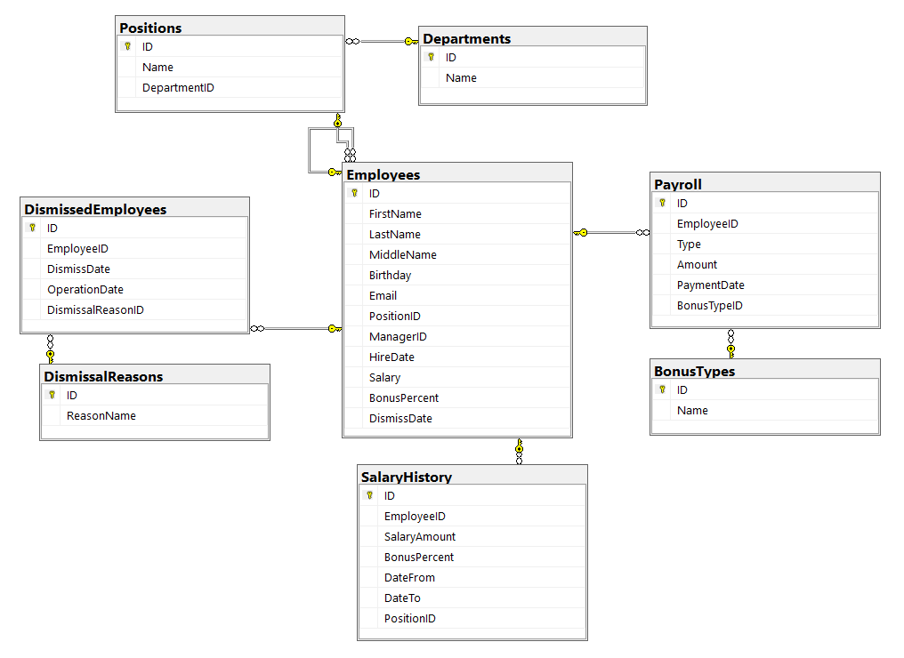
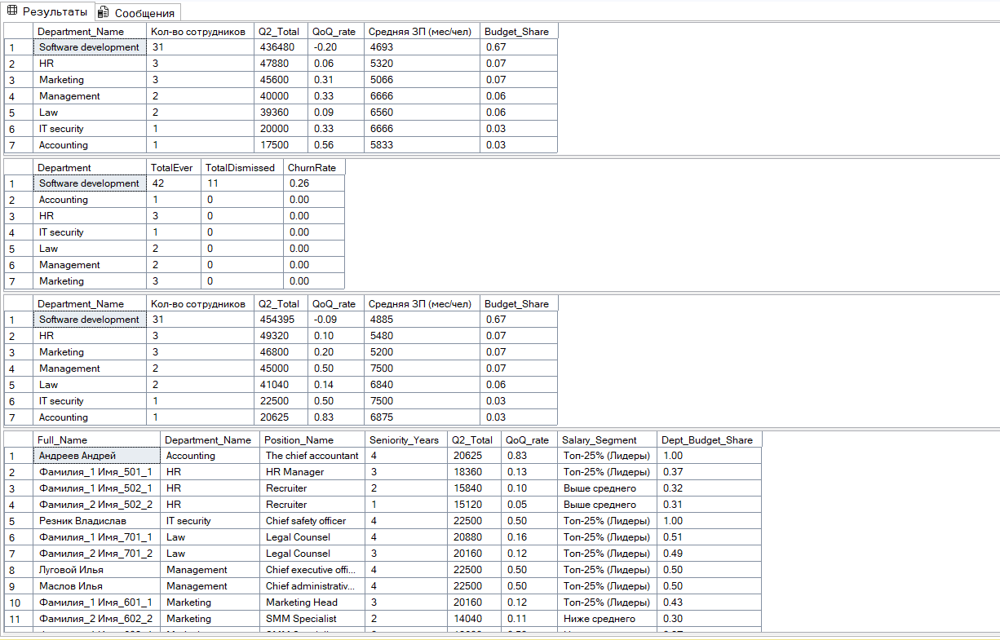

# Staff Database: HR & Financial Analytics

### Цели проекта:
Создание системы учета персонала и HR-аналитики выплат.

### Основные используемые технологии:
SQL Server, CTE, Window Functions (LAG, NTILE, DENSE_RANK), Triggers, Views.

### Структура базы данных:

**Основные таблицы:**
* Employees - таблица с данными по сотрудникам
* Payroll - таблица с выплатами сотрудникам
* SalaryHistory - таблица с историей изменений ЗП сотрудников, и триггер trg_Employees_UpdateSalary, который автоматически заполняет SalaryHistory при изменении ЗП, Бонуса и/или Должности у сотрудника из Employees
* DismissedEmployees - таблица с уволенными сотрудниками, и триггер trg_DismissedEmployees_AfterInsert, который автоматически добавляет дату увольнения в таблицу Employees
  (Процесс увольнения реализован через Soft Delete, чтобы сохранять данные по всем сотрудникам даже после их увольнения)

**Справочники:**
* Positions с Departments - справочники должностей и отделов, в PositionID завязан DepartmentID
* BonusTypes - справочник типов бонусов
* DismissalReasons - справочник с причинами увольнения

Представление View_Employees_Analytical_Core - денормализует данные по сотрудникам

#### Диаграмма базы данных Staff_DB

### Аналитические отчеты:
* "CashFlow аналитика ЗП по отделам (Q2 vs Q1)" - оценка реальных затрат компании на ЗП сотрудникам
* "Аналитика оттока персонала (Churn Rate) по отделам" -  оценка стабильности команд и выявление проблемных зон.
* "HR аналитика ЗП по отделам (Q2 vs Q1)" - оценка затрат на персонал и эффекта от индексаций.
* "HR аналитика ЗП по сотрудникам (Q2 vs Q1)" - персональный анализ компенсаций, выявление лидеров и оценка соответствия уровня ЗП рынку.

**Реализованы две модели учета:** Кассовый метод (Cash Flow) и Метод начисления со сдвигом периода выплат для корректного анализа корректировки зарплат.
Особое внимание уделено анализу корректировки заработных плат (март 2026), результаты которой наглядно прослеживаются в разнице между кассовым и управленческим отчетами.

#### Вывод аналитических отчетов

### Как запустить:
1) Создать базу данных MS SQL через запуск кода (нажать F5, для SSMS) в файле Create_Staff_DB.sql
2) Запустить скрипт на нужный отчет в файле Analyst_Staff_DB.sql
